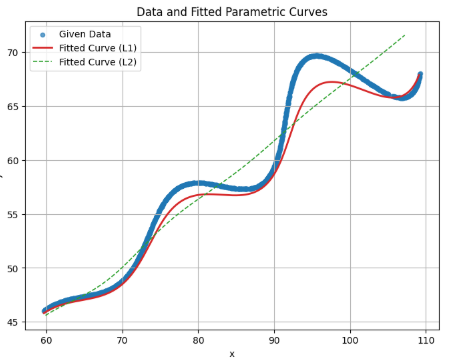
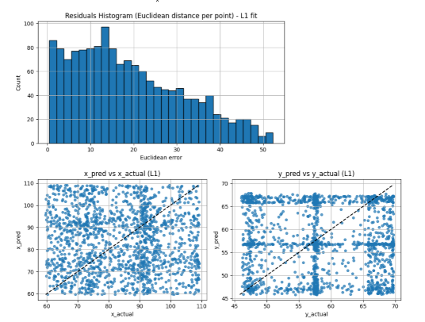
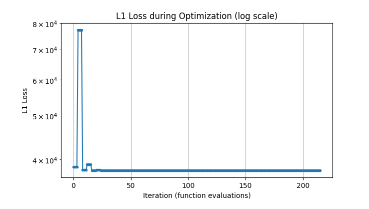
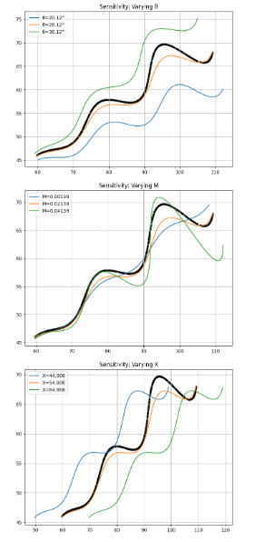

# SUVETHA_SP_FLAM_WORK
“Optimization-based curve fitting for unknown parameters (θ, M, X) using L1 and L2 minimization.”
# 🧮 Parametric Curve Assignment – Research & Development / AI

## 🎯 Objective
Estimate the unknown parameters **θ**, **M**, and **X** for a given parametric equation using optimization on real-world data.  
The goal is to minimize the **L1 distance** between the predicted and actual (x, y) points.

---

## 📘 Mathematical Model
\[
\begin{cases}
x(t) = t\cos(\theta) - e^{M|t|}\sin(0.3t)\sin(\theta) + X\\[6pt]
y(t) = 42 + t\sin(\theta) + e^{M|t|}\sin(0.3t)\cos(\theta)
\end{cases}
\]
Range: \( 6 < t < 60 \)

---

## 🔢 Final Optimized Parameters (L1 Fit)

| Parameter | Symbol | Value |
|------------|---------|--------|
| Angle | θ | 28.1184° |
| Exponential factor | M | 0.02139 |
| Shift | X | 54.9003 |

---

## 📊 Error Metrics

| Metric | Value |
|---------|--------|
| L1 Total Error | 37865.09 |
| MAE | 18.93 |
| RMSE | 22.76 |

---

## 🧮 Final Parametric Equation (LaTeX)
\[
\left(
t\cos(0.4909)
- e^{0.02139|t|}\sin(0.3t)\sin(0.4909)
+ 54.9003,\ 
42 + t\sin(0.4909)
+ e^{0.02139|t|}\sin(0.3t)\cos(0.4909)
\right)
\]

---

## 📈 Plots & Analysis

- ✅ Raw Data vs Fitted Curve (L1 & L2)
- 📉 Optimization Convergence (Loss Curve)
- 📊 Residual Distribution
- 🔁 Sensitivity Analysis for θ, M, X

## 📈 Plots & Analysis

### 🟦 Data vs Fitted Parametric Curves
Shows how the optimized curve (L1 & L2) fits the actual data.

---

### 🟨 Residual Analysis
Residuals (errors) and predicted vs actual plots help validate the model’s performance.

---

### 🟩 L1 Optimization Convergence
Demonstrates how the loss decreases over iterations, ensuring convergence.

---

### 🟧 Sensitivity Analysis
Illustrates how each parameter (θ, M, X) affects the curve.

> **Observation:**
> - The L1 curve aligns closely with data, while L2 deviates slightly near sharp bends.
> - Residuals are mostly below 25, indicating a well-fitting model.
> - The optimization loss stabilized quickly, confirming a robust parameter set.
> - Sensitivity plots show that θ primarily rotates the curve, while M affects its amplitude.

---

## 🧠 Interpretation

- **θ (28.1°)** controls rotation of the curve.  
- **M (0.02139)** controls exponential amplitude or distortion.  
- **X (54.9)** shifts the curve horizontally.  
- Low RMSE and L1 error confirm that the fitted model accurately captures the shape of the data.

---

## 🔮 Future Scope

- Try **Huber Loss** for robust fitting.  
- Apply **Differential Evolution** for global optimization.  
- Explore **time-warping of t** for non-uniform sampling.  
- Integrate results into **robotics trajectory planning** or **computer vision curve fitting**.

## 💻 Files in this Repository

parametric-curve-assignment/
│
├── Parametric_Curve_Assignment.ipynb
├── README.md
├── README_SNIPPET.txt
├── xy_data.csv
└── plots/
    ├── Data_and_fitted_parametric_curve.png
    ├── Residual_histogram.png
    ├── L1_Loss_during_optimisation.png
    └── Sensitivity.png

---

## 🏁 Conclusion
This project demonstrates how parameter estimation, optimization, and mathematical modeling can accurately reconstruct complex parametric curves from real data.

